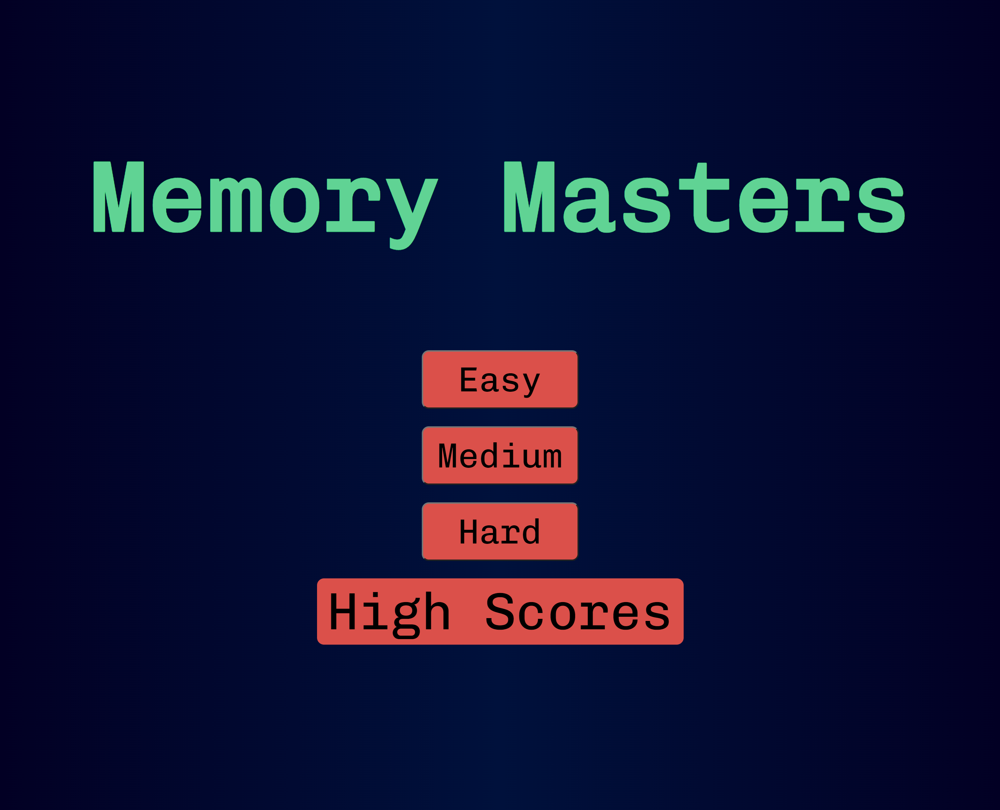
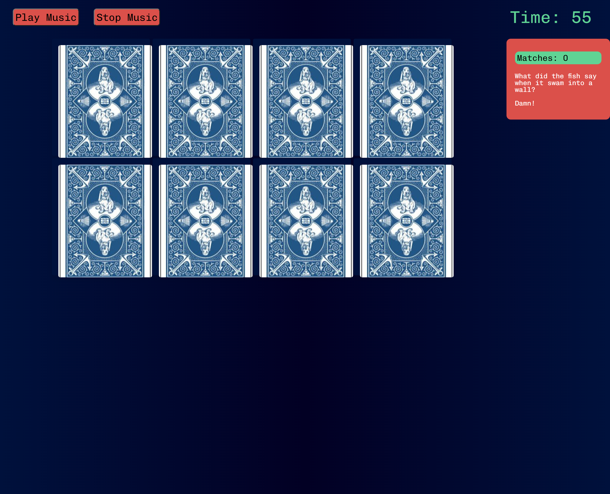
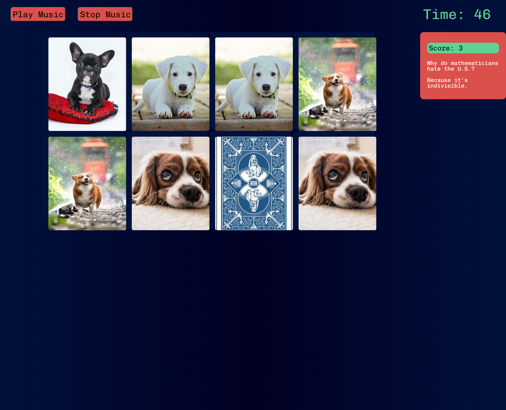
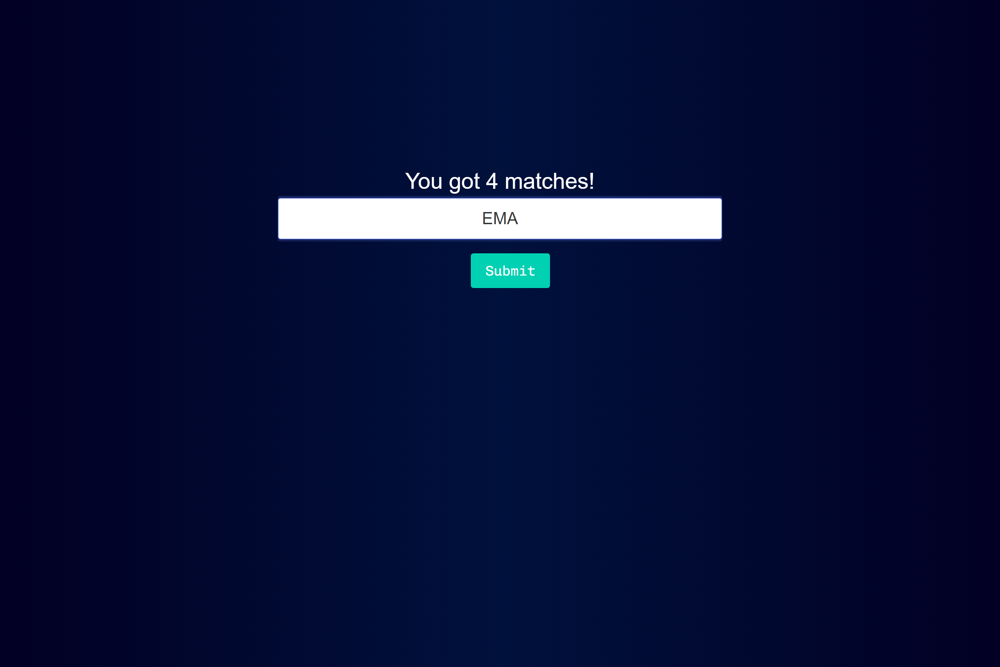
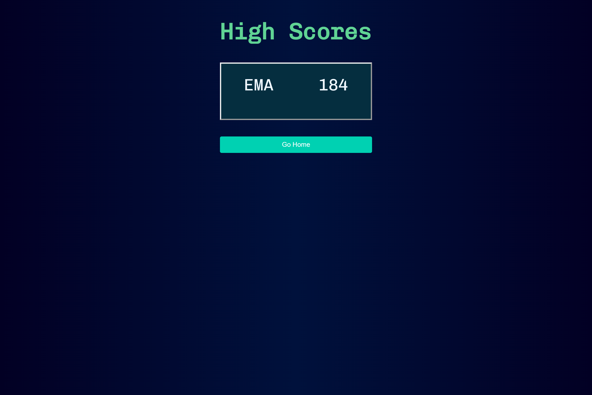
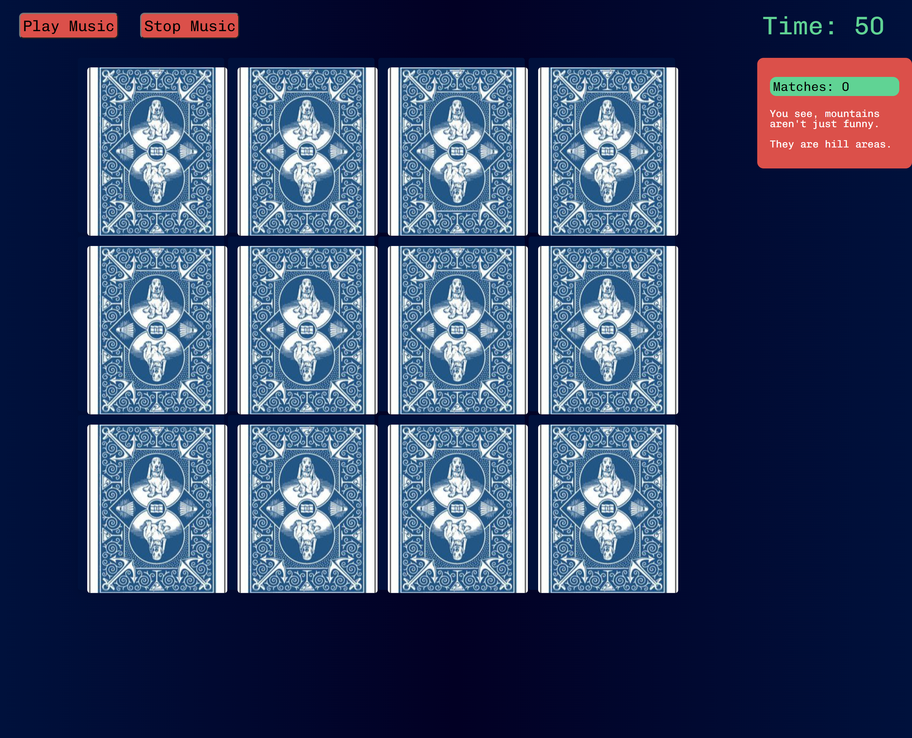
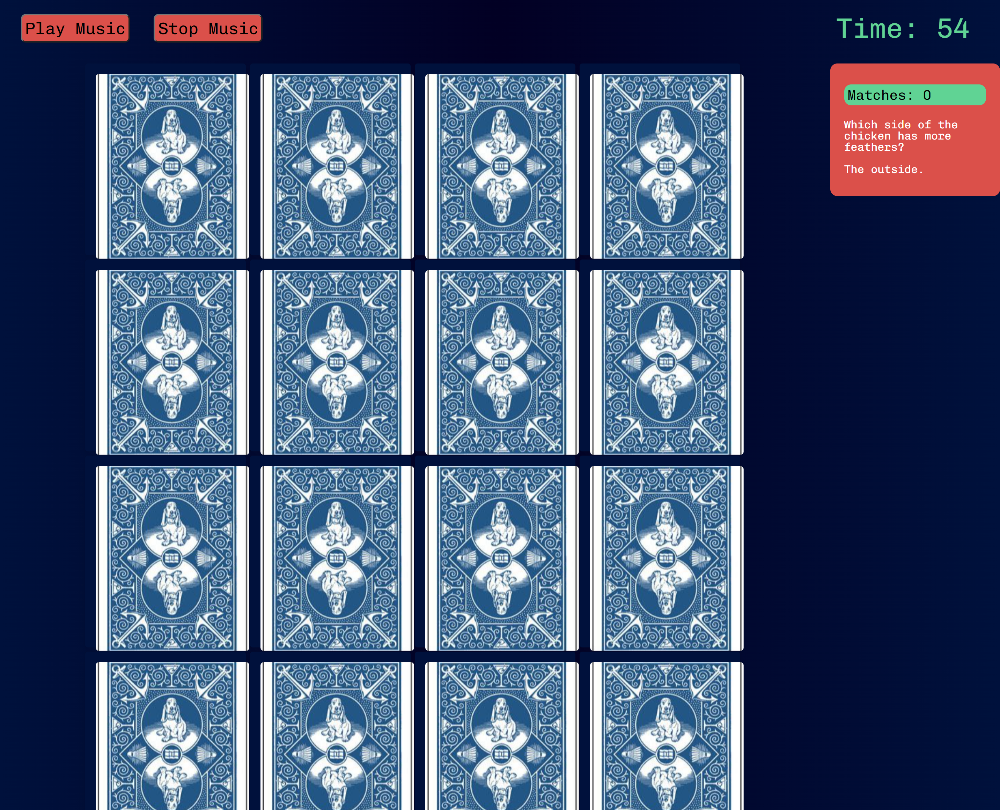

# Memory Game and Jokes 
This is a memory game where the user needs to match pairs of images hidden behind cards. The game uses two server-side APIs to provide the images and jokes displayed on the page.

## How to Play
The game starts when the user selects the level of difficulty and he will be redirected to the game page. The user can select the level of difficulty by clicking on the "Easy", "Medium", or "Hard" button.  
The user then needs to click on two cards to reveal the images hidden behind them. If the images match, the cards will remain flipped over. If the images do not match, the cards will flip back over. The user continues to click on cards until all the cards have been matched or the timer runs out.  
The user can insert his initials at the end of the game to save his score. While playing the game, the user will see a timer counting down from 90 seconds. The final score is based on the timer left and the number of matches made.  
The user can listen to a music while playing the game by clicking on the "Play Music" button, also it is possible to pause the music by clicking on the "Pause Music" button.

## Features
- The game uses two server-side APIs to provide the images and jokes displayed on the page.
- The game provides a friendly user interface with a landing page, a game page, and a final page which displays the user's score.
- The game uses a timer to keep track of the time the user takes to complete the game.
- The game uses a modal to display the user's score when the game is completed or timer runs out and users can add their initials at the end of the game.
- The game have three levels of difficulty: easy, medium, and hard.
- The game offer the user the option to listen a music while playing the game.

## Technologies Used
- HTML
- CSS
- JavaScript
- Google fonts
- Bulma CSS framework

## APIs Used
The game uses two server-side APIs:

- Pixabay: This API provides a random image to be used as the background for each card. The image is fetched from a public image hosting service.
- Official Joke: This API: provides a random joke to be displayed at the bottom of the page. The joke is fetched from a public joke API.

## License
This game is licensed under the MIT License. See the LICENSE file for more details.

## Contributors
- [@AngadBatth](https://github.com/AngadBatth) 
- [@ElisaMarchete](https://github.com/ElisaMarchete)
- [@Hiroro1989](https://github.com/Hiroro1989)
- [@leandromangubat](https://github.com/leandromangubat)
- [@mahdi83777](https://github.com/mahdi83777)

## Screenshot and link for the deployed application

[Link deployed application](https://angadbatth.github.io/memory-game/)